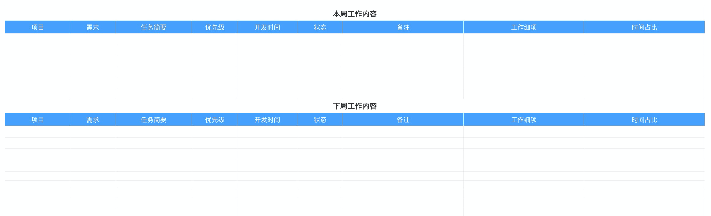
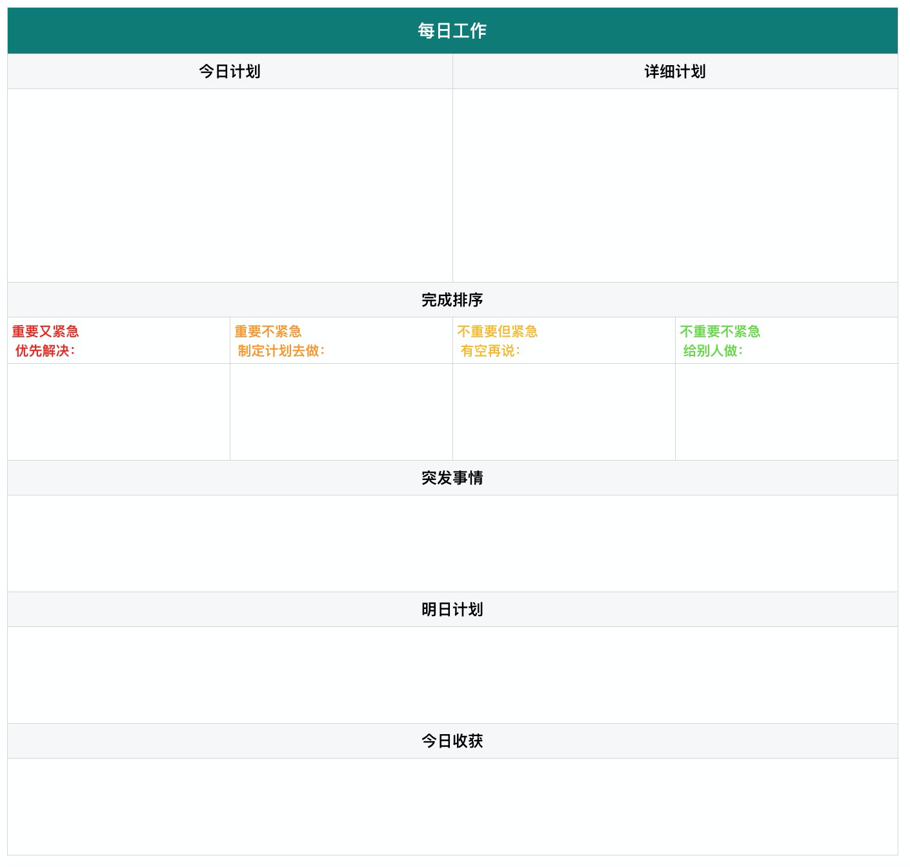

# 周报制度

通常情况（除了法定假日，公司活动）每周“五”三点前需要通过邮件向上级发送周报。描述本周的工作内容。
为了方便周报的汇总整理，小组成员需要统一周报格式，周报模板按需下载使用，在表格中填写完周报后，复制粘贴到邮件中即可。

## 周报模板下载

[周报模板.numbers](https://f2.xiyunerp.com/%E5%91%A8%E6%8A%A5%E6%A8%A1%E6%9D%BF.numbers)  
[周报模板.xlsx](https://f2.xiyunerp.com/%E5%91%A8%E6%8A%A5%E6%A8%A1%E6%9D%BF.xlsx)

### 如何高效整理每日工作

GTD 是 `Getting Things Done` 的缩写，翻译过来就是 “把事情处理完”，是一个管理时间的方法。  
GTD 的核心理念就是必须记录下来要做的事，然后整理安排并使自己一一去执行。  
GTD 的五个核心原则是：收集、整理、组织、回顾、执行。

所以根据以往的记录经验，制作了一份每日工作模板。

## 日报模板下载

[每日工作模板.numbers](https://f2.xiyunerp.com/%E6%AF%8F%E6%97%A5%E5%B7%A5%E4%BD%9C%E6%A8%A1%E6%9D%BF.numbers)  
[每日工作模板.xlsx](https://f2.xiyunerp.com/%E6%AF%8F%E6%97%A5%E5%B7%A5%E4%BD%9C%E6%A8%A1%E6%9D%BF.xlsx)  

